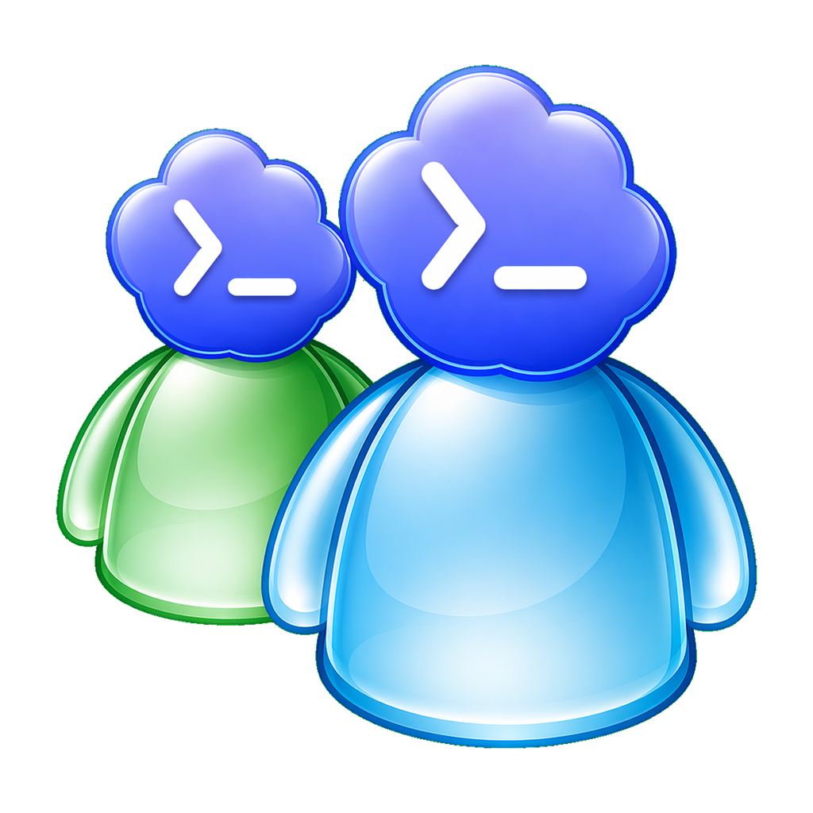

# Codex Messenger

Codex Messenger est une application desktop Electron inspirée de MSN Messenger 7. Elle sert de wrapper local pour Codex: chaque agent, projet ou fil Codex devient une conversation, avec fenêtre de chat, sons MSN, Wizz, envoi d'images/fichiers, caméra, messages vocaux et mini-jeux pendant que Codex travaille.

L'application est pensée d'abord pour Windows. Le français est la langue par défaut; l'anglais est disponible depuis l'écran de connexion.

## Installation Rapide

### Option 1: installateur Windows

1. Ouvrir la page [Releases](https://github.com/anisayari/codex-messenger/releases).
2. Télécharger `Codex.Messenger.Setup.x.y.z.exe`.
3. Lancer l'installateur.
4. Au premier lancement, vérifier que Codex est détecté ou choisir manuellement le chemin vers `codex.cmd` / `codex.exe`.

Si Windows SmartScreen affiche un avertissement, c'est attendu pour une application non signée. Continuer uniquement si le fichier vient bien de la release GitHub officielle.

### Option 2: version portable

Télécharger `Codex.Messenger.x.y.z.exe` depuis les releases, puis le lancer directement. Aucun installateur n'est nécessaire.

### Option 3: depuis le code source

Prérequis:

- Node.js 20 ou plus récent.
- npm.
- Codex CLI installé localement.

```powershell
git clone https://github.com/anisayari/codex-messenger.git
cd codex-messenger
npm install
npm run check:codex
npm run electron:start
```

## Scripts Utiles

```powershell
# Vérifie que Codex CLI est détectable
npm run check:codex

# Build du renderer Vite
npm run build

# Lance l'application Electron
npm run electron:start

# Lance Electron en mode dev avec Vite
npm run electron:dev

# Smoke test Electron
npm run electron:smoke

# Build Windows: installateur + portable
npm run package:win
```

Deux raccourcis PowerShell sont aussi fournis:

```powershell
.\launch-codex-messenger.ps1
.\launch-web-preview.ps1
```

`launch-web-preview.ps1` démarre Vite et ouvre le preview web. L'application complète reste Electron, car les APIs Codex, fichiers, caméra et fenêtres passent par le process principal.

## Fonctionnalités

- Interface Windows XP / MSN Messenger 7 avec fenêtres de conversation.
- Connexion à `codex app-server` depuis le process principal Electron.
- Aucune clé API exposée au renderer.
- Contacts Codex: agent principal, reviewer, designer, projets locaux et fils récents.
- Création d'agents personnalisés depuis `Add a Contact`, avec nom, groupe, statut, icône, couleur et instructions dédiées.
- Liste de contacts groupée façon Messenger.
- Agents, projets et conversations récentes affichés comme de vrais contacts MSN avec avatars générés.
- Fenêtre de discussion centrée sur le contact: plus de navigateur de fils dans la conversation.
- Une fenêtre par conversation.
- Streaming des réponses Codex sans doublons.
- Sons MSN pour nouveau message et Wizz.
- Pack sons MSN 7 extrait localement: nouveau message, e-mail, Wizz/Nudge, présence en ligne, sonnerie, téléphone, saisie et invite terminée.
- Clins d'oeil animés depuis l'archive MSN, envoyables depuis le panneau `Act`; Codex peut aussi en envoyer avec les marqueurs `[wink:...]`.
- Wizz quand Codex termine ou quand un message reste non lu trop longtemps.
- Envoi de fichiers et images à Codex.
- Capture caméra locale avant envoi.
- Enregistrement de messages vocaux.
- Image de profil, statut et message personnel.
- Mini-jeux locaux: Morpion, Memory et Wizz Reflex.
- Mini-jeux habillés avec des assets MSN extraits.
- Packaging Windows avec installateur NSIS et exécutable portable.

## Détection De Codex

Codex Messenger cherche Codex dans cet ordre:

1. Le chemin saisi dans l'écran de connexion.
2. La variable `CODEX_MESSENGER_CODEX_PATH`.
3. Le `PATH` système (`where codex` sur Windows).

Fallback manuel PowerShell:

```powershell
$env:CODEX_MESSENGER_CODEX_PATH="C:\Users\vous\AppData\Roaming\npm\codex.cmd"
npm run electron:start
```

Si la détection échoue dans l'application:

- cliquer sur `Parcourir`;
- sélectionner `codex.cmd`, `codex.exe` ou le binaire équivalent;
- cliquer sur `Tester`;
- relancer la connexion.

## Configuration

Variables d'environnement utiles:

```powershell
# Chemin manuel vers Codex CLI
$env:CODEX_MESSENGER_CODEX_PATH="C:\chemin\vers\codex.cmd"

# Dossier de travail par défaut pour Codex
$env:CODEX_MESSENGER_WORKSPACE="C:\Users\vous\Desktop\projects"

# Racine scannée pour la liste des projets
$env:CODEX_MESSENGER_PROJECTS_ROOT="C:\Users\vous\Desktop\projects"

# Délai avant Wizz de rappel non lu, en millisecondes
$env:MSN_UNREAD_WIZZ_MS="300000"
```

## Données Locales

En développement, les uploads temporaires sont stockés dans le dossier du projet.

Dans l'application packagée, les settings, uploads et images de profil sont stockés dans le dossier utilisateur Electron (`userData`). Cela évite d'écrire dans `app.asar`.

## Packaging Windows

```powershell
npm install
npm run package:win
```

Les fichiers générés sont dans `release/`:

- `Codex Messenger Setup x.y.z.exe`: installateur Windows.
- `Codex Messenger x.y.z.exe`: version portable.
- `win-unpacked/`: dossier non compressé pour test local.

Le build n'est pas signé. Pour une distribution publique large, il faudra ajouter une signature de code Windows.

## Vérification D'Intégrité

Avant de publier ou de modifier l'app:

```powershell
npm run check:codex
npm run build
npm run electron:smoke
```

Pour vérifier l'exécutable généré:

```powershell
& ".\release\win-unpacked\Codex Messenger.exe" --smoke-test
```

Les logs Electron du type `Gpu Cache Creation failed` peuvent apparaître pendant les smoke tests Windows. Le test est considéré OK si la commande termine avec le code `0`.

## Dépannage

### `codex` n'est pas détecté

Définir `CODEX_MESSENGER_CODEX_PATH` ou choisir le binaire depuis l'écran de connexion.

### Double-clic sur `index.html`

Le fichier `index.html` est un point d'entrée Vite. Il ne doit pas être utilisé directement en `file://`. Utiliser plutôt:

```powershell
npm run dev
```

ou:

```powershell
npm run electron:start
```

### SmartScreen bloque l'installateur

L'application n'est pas signée. Vérifier que l'exécutable vient de la release GitHub officielle, puis utiliser `Informations complémentaires` > `Exécuter quand même`.

## Licence

MIT. Voir [LICENSE](LICENSE).
