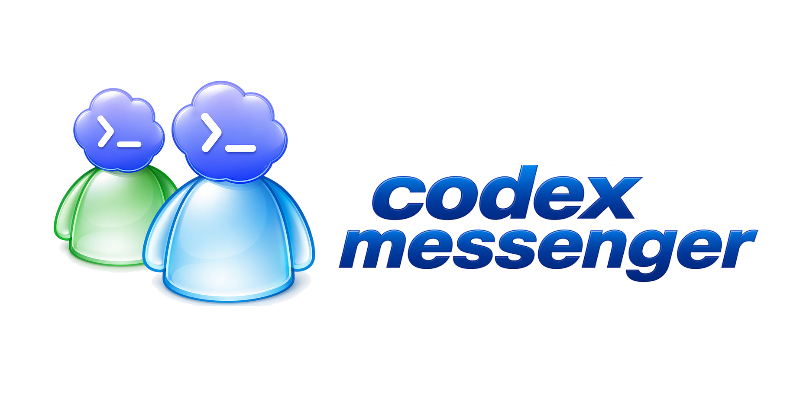
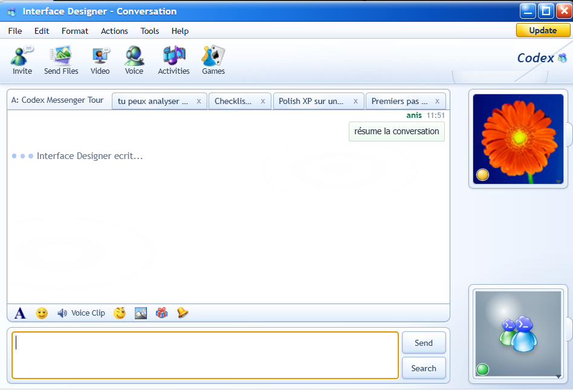
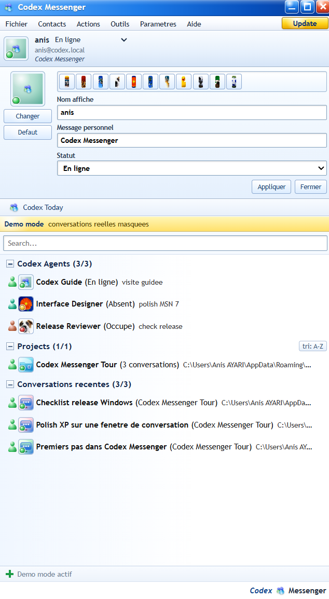

# Codex Messenger

[](https://github.com/anisayari/codex-messenger/actions/workflows/ci.yml)
[](https://github.com/anisayari/codex-messenger/actions/workflows/codeql.yml)
[](https://github.com/anisayari/codex-messenger/actions/workflows/dependency-review.yml)
[](https://github.com/anisayari/codex-messenger/actions/workflows/deploy-codexmessenger-net.yml)
[](LICENSE)
[](https://github.com/anisayari/codex-messenger/releases)
[](#quick-install)

Codex Messenger is a Windows and macOS desktop Electron app inspired by MSN Messenger 7. It wraps a local Codex session in a Messenger-style interface: every Codex agent, project, or recent thread appears as a contact or conversation window with XP-era visuals, MSN sounds, Wizz/Nudge, file and image sending, camera capture, voice clips, profile pictures, status messages, and small games while Codex is working.

Developed by Anis AYARI and Codex.

French is the default language in the app, with English, Spanish, and Japanese available from the login screen.

Important: Codex Messenger is only a local front-end client for `codex app-server`. It is not Codex itself, does not own your Codex conversations, and should not be treated as a backup or storage layer for Codex data. Use it at your own risk.

## Interface Preview

<p>
  
  
</p>

## Quick Install

Official downloads are available from [codexmessenger.net](https://codexmessenger.net/). Click `DOWNLOAD` and choose the platform in the popup:

- macOS `v0.0.2.7`: `CodexMessenger-mac-arm64.dmg`.
- Windows `v0.0.2.7`: `CodexMessenger.exe`.

The website download popup is backed by GitHub release assets. A release must include both the Windows `.exe` and macOS `.dmg`; otherwise the site deployment should fail instead of publishing a broken download button.

### Option 1: Windows installer

1. Open the [Releases](https://github.com/anisayari/codex-messenger/releases) page.
2. Download the Windows `.exe` asset, or use the Windows button on [codexmessenger.net](https://codexmessenger.net/).
3. Run the installer.
4. On first launch, confirm that Codex is detected or manually select the path to `codex`, `codex.cmd`, or `codex.exe`.

If Windows SmartScreen shows a warning, that is expected for an unsigned app. Continue only if the file comes from the official GitHub release.

If Codex Messenger is already installed, use the launcher or the Windows app entry to check for updates or uninstall the front client. Uninstalling Codex Messenger must not be used to delete Codex conversations, project files, or Codex CLI data.

### Option 2: macOS app

1. Open the [Releases](https://github.com/anisayari/codex-messenger/releases) page.
2. Download the macOS `.dmg` for your Mac architecture, or use the macOS button on [codexmessenger.net](https://codexmessenger.net/).
3. Open `Codex Messenger.app`.
4. On first launch, confirm that Codex is detected or manually select the path to `codex`.

The macOS build is unsigned. If Gatekeeper blocks the first launch, use right-click -> `Open` and continue only if the file comes from the official GitHub release.

### Option 3: portable Windows build

Download the portable Windows `.exe` from the releases page and run it directly. No installer is required.

### Option 4: from source

Requirements:

- Node.js 20 or newer.
- npm.
- Codex CLI installed locally.

```sh
git clone https://github.com/anisayari/codex-messenger.git
cd codex-messenger
npm install
npm run check:codex
npm run electron:start
```

## Useful Scripts

```sh
# Verify that Codex CLI can be detected
npm run check:codex

# Install/check Codex CLI and start OpenAI login if needed
npm run setup:codex

# Check Codex CLI, npm, and login state without changing the machine
npm run setup:codex:check

# Run the Node test suite
npm test

# Run npm security audit for production and development dependencies
npm run audit:security

# Run release metadata checks
npm run test:release

# Build the Vite renderer
npm run build

# Run tests, release checks, renderer build, and Electron smoke test
npm run ci

# Start the Electron app
npm run electron:start

# Start Electron in development mode with Vite
npm run electron:dev

# Electron smoke test
npm run electron:smoke

# Build Windows installer and portable executable
npm run package:win

# Build unsigned macOS DMG and ZIP for the current architecture
npm run package:mac

# Build unsigned macOS DMG and ZIP for both x64 and arm64
npm run package:mac:all

# Build signed/notarized macOS DMG and ZIP for release
npm run package:mac:release

# Build an unpacked macOS .app for local testing
npm run package:mac:dir

# Distribution aliases
npm run dist:win
npm run dist:mac
npm run dist:mac:release
```

Launchers are organized by platform:

```powershell
.\launchers\windows\launch-codex-messenger.ps1
.\launchers\windows\launch-web-preview.ps1
```

```sh
./launchers/macos/launch-codex-messenger.command
./launchers/macos/launch-web-preview.command
```

The root PowerShell files `launch-codex-messenger.ps1` and `launch-web-preview.ps1` are compatibility wrappers around the Windows launchers.

The Windows launcher opens a small control panel. It can launch Codex Messenger, check the latest GitHub version, open the update page, or uninstall only the Codex Messenger front client. It leaves Codex conversations and project data untouched.

The Windows and macOS app launchers run the Codex setup check first. If Codex CLI is missing and Node.js/npm is available, they install `@openai/codex`; if Codex is not logged in, they open `codex login` for the OpenAI login flow. The macOS launcher then opens the packaged app from `release/macos/` when it exists, or starts source development mode. The web preview launchers start Vite and open the browser preview. The full application is still Electron-only because Codex integration, filesystem access, camera capture, and conversation windows run through the main process.

## Updates

Codex Messenger checks for updates on startup:

- Codex Messenger front: compares the local app version with the version published in the GitHub repository.
- Codex app-server: checks the local `codex --version` output and compares it with the public `@openai/codex` npm package.

When an update is available, an `Update` button appears at the top of the main window. You can also open `File -> About Codex Messenger...` or `File -> Check for updates` to see the current version and run a manual check.

The Codex Messenger front update button downloads the latest GitHub release asset for the current platform, verifies its SHA-256 digest when GitHub exposes one, then starts the installer. On Windows it runs the NSIS installer after the app exits. On macOS it installs from the downloaded DMG, replaces the current app bundle, and relaunches the app; unsigned/ad-hoc builds can still require the normal macOS security confirmation on first launch. The Codex app-server update button runs `npm install -g @openai/codex@latest`.

## Uninstall

Use Windows Apps settings, the original installer entry, or:

```powershell
.\launchers\windows\launch-codex-messenger.ps1
```

Then click `Uninstall`.

The uninstaller is intended to remove only the Codex Messenger front client, shortcuts, and application files. It should not remove:

- Codex conversations.
- Codex CLI configuration or caches.
- Your project folders.
- Files outside the Codex Messenger install directory.

## Features

- Windows XP / MSN Messenger 7 inspired interface.
- One desktop window per Codex conversation.
- Connection to `codex app-server` from the Electron main process.
- No API keys exposed to the renderer.
- Codex response language selection: French by default, plus English, Spanish, and Japanese.
- Language definitions centralized in `shared/languages.js` so new languages can be added quickly.
- Codex contacts for the main agent, reviewer, designer, local projects, custom agents, and recent threads.
- Custom agents created from `Add a Contact`, with name, group, status, icon, color, and dedicated instructions.
- Demo mode from the `Help` menu, with isolated showcase agents, a showcase project, and seeded demo threads that do not list real Codex conversations.
- Messenger-style grouped contact list.
- Generated avatars for agents, projects, and recent conversations.
- Conversation windows focused on the selected contact.
- Project threads displayed as MSN-style tabs above the transcript, with drag reorder and delete controls.
- Streaming Codex responses without duplicate final messages.
- MSN sounds for new messages and Wizz/Nudge.
- Local MSN 7 sound pack: new message, new email, Wizz/Nudge, online presence, ring, phone, typing, and task complete.
- MSN Messenger 7.5.0322 assets extracted from the archived Microsoft installer: PNG, GIF, JPG, bitmaps, icons, UI resources, and integrity manifests.
- MSN emoticon pack extracted from the original 19 px strips, available from the smile button and rendered inline in messages.
- Extracted MSN CAB packages: 15 official winks, 4 dynamic backgrounds, and preserved MSN Search resources under `public/msn-assets/msn75/packages`.
- Winks can be sent from the Activities panel; Codex can also trigger them with `[wink:...]` markers.
- Wizz when Codex finishes or when an unread message stays unattended for too long.
- Send files and images to Codex.
- Local camera snapshot before sending.
- Voice clip recording.
- Profile picture, status, and personal message.
- Local mini-games: Tic-Tac-Toe, Memory, and Wizz Reflex.
- Mini-games styled with extracted MSN assets.
- Windows packaging with NSIS installer and portable executable.

## Codex Detection

Codex Messenger needs:

- Node.js/npm when Codex CLI must be installed automatically.
- Codex CLI 0.125.0 or newer, installed as `@openai/codex`.
- A completed OpenAI login through `codex login`.

From source, run:

```sh
npm run setup:codex
```

For a read-only readiness check:

```sh
npm run setup:codex:check
```

The app login screen also checks these prerequisites. If npm is missing, it opens the Node.js download page. If Codex CLI is missing or older than 0.125.0, it can run `npm install -g @openai/codex`. If OpenAI login is missing, it opens a terminal for `codex login`.

Codex Messenger looks for Codex in this order:

1. The path entered on the login screen.
2. The `CODEX_MESSENGER_CODEX_PATH` environment variable.
3. The system `PATH` using `where codex` on Windows or `which codex` on macOS/Linux.

On Windows, if npm returns an extensionless shim such as `C:\Users\you\AppData\Roaming\npm\codex`, the app automatically checks `codex.cmd`, `codex.exe`, and `codex.bat`.

Manual PowerShell fallback:

```powershell
$env:CODEX_MESSENGER_CODEX_PATH="C:\Users\you\AppData\Roaming\npm\codex.cmd"
npm run electron:start
```

Manual macOS/Linux fallback:

```sh
export CODEX_MESSENGER_CODEX_PATH="$(which codex)"
npm run electron:start
```

If detection fails inside the app:

1. Click `Browse`.
2. Select `codex`, `codex.cmd`, `codex.exe`, or an equivalent binary.
3. Click `Test`.
4. Connect again.

## Configuration

Useful environment variables:

```powershell
# Manual path to Codex CLI
$env:CODEX_MESSENGER_CODEX_PATH="C:\path\to\codex.cmd"

# Optional default profile email for first launch
$env:CODEX_MESSENGER_DEFAULT_EMAIL="you@example.com"

# Default working directory for Codex
$env:CODEX_MESSENGER_WORKSPACE="C:\Users\you\Desktop\projects"

# Root scanned for local projects
$env:CODEX_MESSENGER_PROJECTS_ROOT="C:\Users\you\Desktop\projects"

# Delay before unread Wizz reminder, in milliseconds
$env:MSN_UNREAD_WIZZ_MS="300000"
```

macOS/Linux:

```sh
# Manual path to Codex CLI
export CODEX_MESSENGER_CODEX_PATH="/opt/homebrew/bin/codex"

# Optional default profile email for first launch
export CODEX_MESSENGER_DEFAULT_EMAIL="you@example.com"

# Default working directory for Codex
export CODEX_MESSENGER_WORKSPACE="$HOME/Desktop/projects"

# Root scanned for local projects
export CODEX_MESSENGER_PROJECTS_ROOT="$HOME/Desktop/projects"

# Delay before unread Wizz reminder, in milliseconds
export MSN_UNREAD_WIZZ_MS="300000"
```

## Local Data

In development, temporary uploads are stored inside the project folder.

In packaged builds, settings, uploads, and profile pictures are stored in Electron's user data directory. This avoids writing inside `app.asar`.

Codex conversations remain managed by Codex and your local Codex setup. Codex Messenger reads and sends messages through `codex app-server`; it is not the source of truth for conversation storage.

## Packaging

```powershell
npm install
npm run package:win
```

Generated Windows files are written to `release/windows/`:

- `Codex Messenger Setup 0.0.2-7.exe`: Windows installer.
- `Codex Messenger 0.0.2-7.exe`: portable build.
- `win-unpacked/`: unpacked folder for local testing.

The build is not signed. For broad public distribution, add Windows code signing.

macOS unsigned local build:

```sh
npm install
npm run package:mac
```

Generated macOS files are written to `release/macos/`:

- `Codex-Messenger-0.0.2-7-arm64.dmg` or `Codex-Messenger-0.0.2-7-x64.dmg`.
- `Codex-Messenger-0.0.2-7-arm64.zip` or `Codex-Messenger-0.0.2-7-x64.zip`.
- `mac-arm64/` or `mac/`: unpacked app folder for local testing.

The unsigned macOS build includes camera and microphone usage descriptions for the snapshot and voice clip features, but it is not notarized or Developer ID signed.

macOS signed/notarized release build:

```sh
npm install
npm run package:mac:release
```

Release prerequisites:

- A `Developer ID Application` certificate for team `T99D3SZXLB` installed in the login keychain.
- Notarization credentials provided through one of these supported methods:
  - `APPLE_API_KEY`, `APPLE_API_KEY_ID`, and `APPLE_API_ISSUER`.
  - `APPLE_ID`, `APPLE_APP_SPECIFIC_PASSWORD`, and `APPLE_TEAM_ID=T99D3SZXLB`.
  - `APPLE_KEYCHAIN_PROFILE=codex-messenger`, optionally with `APPLE_KEYCHAIN`.

One-time notary profile setup:

```sh
xcrun notarytool store-credentials codex-messenger --apple-id "<apple-id>" --team-id T99D3SZXLB
```

For public distribution outside the Mac App Store, use `package:mac:release`, not the unsigned local build.

## Static Website Deployment

The static showcase site lives in `codexmessenger.net/`.

Its `DOWNLOAD` button opens a platform chooser popup with:

- macOS `v0.0.2.7`: `downloads/CodexMessenger-mac-arm64.dmg`.
- Windows `v0.0.2.7`: `downloads/CodexMessenger.exe`.

The deploy workflow is `.github/workflows/deploy-codexmessenger-net.yml`. It reads the latest GitHub release, resolves one Windows `.exe` asset and one macOS `.dmg` asset, patches the cache-buster in `codexmessenger.net/index.html`, uploads the static files to the VPS, then downloads the two release assets into `/downloads/` and writes `.sha256` files.

Before publishing the website, verify the release contains both platform artifacts:

- Windows: a `.exe` asset, preferably a `*Setup*.exe`.
- macOS: a `.dmg` asset, preferably the `arm64` build.

See `codexmessenger.net/README-deploy.md` for the VPS/nginx details.

## Integrity Checks

Before publishing or making release changes:

```powershell
npm run check:codex
npm test
npm run audit:security
npm run test:release
npm run build
npm run electron:smoke
```

For the same checks in one command:

```powershell
npm run ci
```

To verify a generated executable:

```powershell
& ".\release\windows\win-unpacked\Codex Messenger.exe" --smoke-test
```

Windows smoke tests may print Electron logs such as `Gpu Cache Creation failed`. The smoke test is considered successful when the command exits with code `0`.

## Troubleshooting

### `codex` is not detected

Run `npm run setup:codex`, set `CODEX_MESSENGER_CODEX_PATH`, or select the binary from the login screen.

### OpenAI login is missing

Run:

```sh
codex login
```

or click `Login OpenAI` on the Codex Messenger login screen, then click `Test`.

### Double-clicking `index.html`

`index.html` is a Vite entry point and should not be opened directly through `file://`. Use:

```powershell
npm run dev
```

or:

```powershell
npm run electron:start
```

### SmartScreen blocks the installer

The app is unsigned. Verify that the executable comes from the official GitHub release, then choose `More info` and `Run anyway`.

### `unknown variant workspace-write`

This means an old Codex Messenger build sent a turn sandbox policy as `workspace-write`. Current `codex app-server` expects `workspaceWrite`, `readOnly`, `externalSandbox`, or `dangerFullAccess` for `turn/start`. Update Codex Messenger to a build that sends app-server policy variants correctly; existing saved settings using CLI-style values are still accepted and converted at runtime.

## Service and Liability Notice

Codex Messenger is an experimental open-source front client for local Codex usage. It is provided "as is", without warranty of any kind.

By installing or using it, you understand that you are responsible for your own machine, projects, Codex configuration, credentials, generated output, and data backups. The project, its contributors, Anis AYARI, and Codex cannot be held responsible for damages, data loss, project corruption, security issues, downtime, costs, or any other consequence arising from installation, update, uninstall, or use of the software.

This project is not affiliated with Microsoft, MSN, Windows Live Messenger, or OpenAI. Names and visual references are used only to describe the intended retro interface style and Codex client behavior.

## License

MIT. See [LICENSE](LICENSE).
