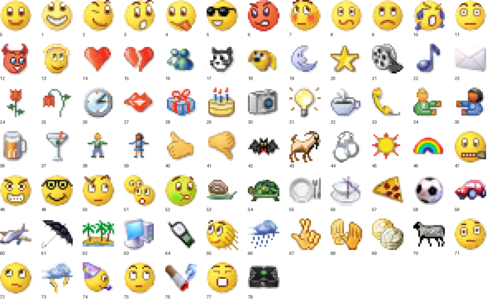

# Inventaire des ressources MSN

Les ressources existantes sont attribuées par le README et les manifests du dépôt à **MSN Messenger 7.5.0322**. Aucun ancien exécutable n’a été lancé et aucun nouveau programme d’installation MSN n’a été téléchargé. Cette provenance ne constitue pas une nouvelle autorisation de redistribution.

## Pack classique retrouvé et vérifié

La ressource `msnmsgr_PNG_727_9.png` contient **79 icônes distinctes**, disposées horizontalement dans une image de **1501 × 19 pixels**. Sa taille est de 54 436 octets et son SHA256 est `066a0f046032e3b9a1c889e31d4d1950683e1cd9fedce51894f6dbce6491852f`. Les 79 fichiers `emoticons-classic/emoticon-000.png` à `emoticon-078.png` sont des découpes exactes de 19 × 19 pixels RGBA. Aucun dessin, agrandissement ou rythme d’animation n’a été inventé.

Les noms officiels proviennent des tables STRING Microsoft `msgslang_string_2876_9.bin` à `2880_9.bin`, identifiants **46000 + index**. Le manifest conserve les hashes des cinq tables, la référence de chaque nom, le hash PNG et le hash RGBA de chaque découpe. Les tests décodent les PNG et comparent chaque pixel au rectangle d’origine, puis relisent les noms dans les tables.

**69 raccourcis officiels** sont attestés par la [page Microsoft MSN Messenger archivée](https://web.archive.org/web/20140204231459id_/http://messenger.msn.com/Resource/Emoticons.aspx). La page obtenue fait 16 049 octets, SHA256 `eb392737add960914526ea7145beaa9da74b43bbfd0706c2497e152e5e9d0d4e`. `emoticons-classic/shortcuts.json` conserve les codes, les noms, les indices et la référence de cette source. Le catalogue actif reprend ces 69 correspondances, dont la véritable icône Messenger `(M)`.

Les dix icônes dont le raccourci n’est pas attesté par cette page restent conservées avec leur nom officiel : Goat (43), Handcuffs (44), Sun (45), Rainbow (46), Turtle (54), Be right back (65), Fingers crossed (67), High five! (68), Cigarette (76), System error (78). Aucun pseudo-raccourci n’a été ajouté pour elles. La ressource manquante est **la table officielle des raccourcis de ces dix entrées**, pas leur image. Les tables STRING donnent leurs noms ; les ressources voisines inspectées ne donnent pas leurs raccourcis.

## Anciens exports et correction des manifests

Les **42 PNG nommés** du précédent export restent dans `emoticons/` pour conserver les ressources. Plusieurs fichiers sont des étapes d’une même animation, incorrectement étiquetées comme des émotions différentes : PNG900 (clin d’œil), PNG904, PNG906 (pinceau), PNG907 (cotillon), PNG908 (orage), PNG909, PNG910, PNG911. Ces noms et raccourcis hérités ne sont pas la table Microsoft officielle et ne servent plus au catalogue actif. PNG701 représente un contact et PNG703 une enveloppe ; ils ne sont pas des émoticônes.

Le manifest principal contenait auparavant **345 références inexistantes** `emoticon-001.png` à `345.png`. Elles ont été remplacées par les 42 fichiers effectivement présents ; le manifest distingue cet export ancien du pack classique de 79 icônes et de ses 69 raccourcis attestés. Les anciens raccourcis sont explicitement signalés comme métadonnées héritées non officielles.

## Autres ressources conservées

| Ressource | Quantité | Utilisation et preuve |
| --- | ---: | --- |
| Enregistrements de ressources MSN | 969 | 1036 fichiers référencés, sources conservées |
| PNG du module msnmsgr | 318 | Vue d’ensemble locale ayant permis de retrouver PNG727 |
| Portraits MSN | 11 | Images d’origine du catalogue des portraits |
| Clins d’œil WINK | 15 | Posters et films SWF originaux des packages 1121–1135 |
| Fonds fixes | 5 | JPG340–344 : course, poissons, cœurs, lavande, planètes |
| Fonds dynamiques | 4 | Koi Pond, Clocks, Mad Scientist, Pixies |
| Membres décodés des fonds | 16 | 4 images fond, 4 downlevel.jpg, 4 XML, 4 SWF ; hashes conservés |
| Membres des packages préservés | 68 | Tous contrôlés par taille et SHA256 |
| Sons WAV historiques | 8 | Ressources existantes ; le son des films WINK vient du SWF original |
| Images d’activités locales | 11 | Leur présence ne prouve pas une connexion aux anciens services MSN |

La ressource JPG726 est une illustration de webcam/profil ; elle n’est pas proposée comme fond. Les six GIF auparavant réutilisés comme clins d’œil ne sont pas des packages WINK Microsoft et sont exclus du catalogue officiel ; leurs fichiers sont conservés.

## Films Flash originaux

Le lecteur **Ruffle 0.6.0** est empaqueté localement, sans CDN. Ses huit fichiers et les licences MIT/Apache sont conservés avec la provenance npm officielle et les hashes. Le tarball officiel a été vérifié par l’intégrité SHA512 publiée avant extraction.

**Les 15 WINK et les 4 films de fonds ont tous été chargés et ont produit des images différentes**, sans erreur JavaScript, dans la fixture Chromium locale. Les métadonnées, hashes sources et captures sont décrits dans `ruffle-playback-results.json`. Les WINK utilisent les sons contenus dans les films originaux ; aucun son arbitraire n’est associé à leur place. Le volume initial et les changements 0 → 1 → 0 ont été vérifiés, mais cela ne remplace pas une écoute humaine sur chaque appareil.

Les fonds conservent leur **aperçu downlevel d’origine** dans l’interface. Le rendu Flash est prouvé, mais les callbacks et le comportement de l’hôte Messenger des fonds ne sont pas reproduits. La durée `numFrames / frameRate` concerne uniquement la timeline racine : Crying et les fonds ont une seule frame racine avec des animations imbriquées. Elle ne prouve pas une durée complète. Aucun faux callback de fin n’est annoncé.

## Isolation et validation

L’iframe locale du lecteur reçoit une politique CSP distincte : scripts limités au runtime local et `wasm-unsafe-eval`, connexions limitées au SWF sélectionné et aux deux fichiers WASM locaux. L’accès des films aux scripts JavaScript hôtes est désactivé ; leur ActionScript d’origine continue de s’exécuter, l’ouverture d’URL est refusée. Le flag Ruffle `allowNetworking: none` ne suffit pas à lui seul à bloquer toutes les sous-ressources en 0.6.0 ; c’est le CSP de l’iframe qui impose ici la restriction. Les messages du lecteur sont validés par origine, fenêtre source et token. En Electron, les ressources sont servies par le protocole local readonly `msn-asset://local`, dont la liste exacte comprend les 19 films et les 5 fichiers de runtime nécessaires. Le frame reste un document local ; son origine sérialisée de transport est `null`.

La fixture du composant React a vérifié le vrai clic de lecture, les requêtes distante et locale hors liste bloquées, le mode muet dès le chargement, les changements de son sans rechargement, la destruction de l’iframe à la fermeture et pendant un chargement, l’aperçu fixe lorsque les animations sont réduites, et le rejet d’une source inconnue. Voir `ruffle-isolation-results.json`. Le smoke Electron natif vérifie séparément le mode file et la navigation exacte du frame.

Les **six tests d’assets** passent intégralement, sans skip : catalogues actifs ; fonds et limites annoncées ; 42 exports anciens et 79 découpes avec pixels/noms Microsoft ; 16 extraits SHA256 ; 68 membres des packages et 8 fichiers Ruffle SHA256 ; références littérales et fichiers du lecteur. Ils ont effectivement passé sur le projet source, pas seulement dans une copie.

31 textes de packages avaient leurs fins de ligne normalisées en LF. Leurs bytes CRLF/BOM d’origine ont été restaurés uniquement lorsque la taille et le SHA256 correspondaient exactement au manifest original. `.gitattributes` interdit la conversion de fin de ligne sous `public/msn-assets/` afin de préserver les checksums. Un nombre de blocs égal à zéro n’est pas interprété comme une absence de données : les petits fichiers compressés macOS peuvent être stockés en attributs étendus. Les tests relisent réellement chaque corps de fichier.
