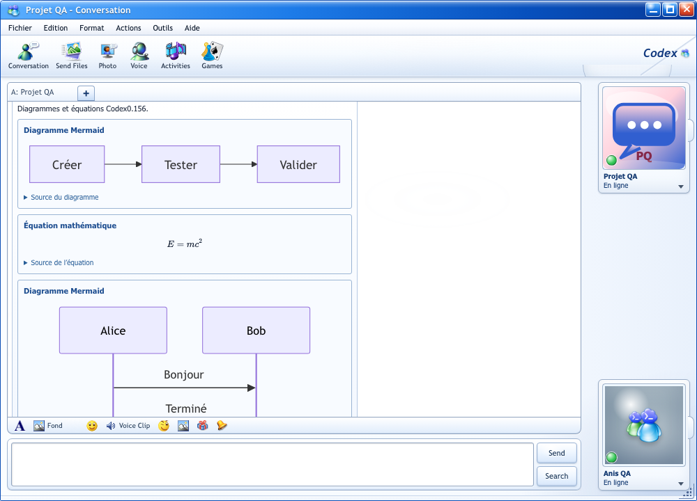

# Validation de la modernisation

La publication suivante de Messenger **v0.0.3 / Codex 0.156.1** est documentée dans [PUBLICATION-0.0.3.md](PUBLICATION-0.0.3.md), avec ses nouveaux contrôles et liens publics. Les résultats ci-dessous sont ceux du 22 septembre.

Cible : Codex CLI/app-server **0.156.0**, vérifiée le 22 septembre 2026 dans npm et les releases officielles GitHub. L’archive contient **50 releases stables de 0.125.0 à 0.156.0**, avec corps officiels, URLs, dates et empreintes. Le frontend source reste en version 0.0.2-9 ; aucune nouvelle distribution n’a été publiée.

## Résultats

| Vérification | Résultat observé | Portée |
| --- | --- | --- |
| Suite Node finale | **240 tests : 237 réussis, 3 live ignorés par défaut, aucun échec** ; 3,39 s | Tous les fichiers tests/*.test.mjs ; Node 24.19, exécution séquentielle sur une copie attestée des sources finales |
| Inférence authentifiée finale | **1/1 réussi**, 6,44 s ; CODEX-MSN-OK en 6 deltas | CLI 0.156.0, client final après protection stop/resume ; historique persistant, restart, resume, fork, recherche et 2 occurrences UTF-16 exactes |
| Métadonnées live finales | **1/1 réussi**, 869 ms | CLI 0.156.0 ; handshake/discovery ; historique avant premier message honnêtement non matérialisé |
| Catalogue live final | **1/1 réussi**, 913 ms | Modèles, skills, modes, profils, objectifs, nom/archive/restauration et PTY réel sans réseau ; quotas et usage indisponibles sans compte signalés honnêtement |
| Métadonnées de distribution | **Release-check réussi** pour 0.0.2-9 / v0.0.2.9 | Minimum Codex 0.156.0, configuration des connecteurs et engines package/lock cohérents |
| Build production final | **Réussi**, 2163 modules, 6,46 s | JS principal 507,89 kB, CSS 125,87 kB ; dist entièrement recopié dans le projet |
| Electron natif final | **Réussi** sur le dernier build et CLI 0.156.0 ; smoke exit 0 en 1736 ms | Preload/IPC, PTY UTF-8/stdin/resize, Mermaid et KaTeX sur message de test, préférence vocale utilisateur isolée, Heart animé/son/fermeture ; isolation Node et CSP préservées |
| Archive officielle | **50/50 fichiers vérifiés**, aucun manquant ni divergence | Corps UTF-8 et métadonnées/source/empreintes conformes aux releases officielles |
| Autodétection du CLI | **23/23 tests ciblés réussis** et détection réelle 0.156.0 | Ancienne version alpha du bureau sur PATH ; NVM et binaire npm natif ; chemins manuels/env conservés, versions inconnues diagnostiquées |
| Audio et préférence vocale | **22 validations réussies** | PCM/worklet, bursts, suspension, mute/unmute, F8 et contrat config utilisateur realtime.voice |
| Renderer | Parcours interactifs et contrôle visuel réussis | Demandes serveur, composition IME, conservation du brouillon, fichiers, dialogues clavier, streaming et sous-agents, recherche/compact/revert, jeu local ; Mermaid et formules sécurisés avec sources accessibles |
| Dépendances installées | npm ci réussi : 464 paquets ; **npm audit sans vulnérabilité** | Production et développement ; Mermaid 11.17.2, KaTeX 0.18.7, DOMPurify 3.4.15, Electron 41.10.7, Vite 7.3.6 |

## Conditions et limites

Les trois fixtures live ignorées par défaut ont été activées séparément sur 0.156.0 et ont chacune réussi.

Les scénarios live utilisent des workspaces et CODEX_HOME privés temporaires et nettoyés. Les tests d’inférence utilisent le compte existant avec ses réglages Auto ; aucune préférence de modèle/effort n’est épinglée dans le projet. Les profils usuels restent inchangés. Aucun crédit de réinitialisation n’est consommé, aucun compte changé, aucune publication effectuée.

Le microphone et la caméra physiques, un appel vocal du compte, les connexions OAuth tiers, les installations et mises à jour signées réelles, le packaging Windows et les fonctions soumises à un modèle/provider restent dépendants de leur environnement. Les tests sur fixtures, PCM et autorisations refusées ne prouvent pas ces accès. Les services privés du bureau Codex et les anciens services MSN fermés sont indiqués dans la matrice ; aucune réponse artificielle ne remplace ces services.

Les 15 clins d’œil originaux sont exécutés avec Ruffle 0.6.0 local : leur ActionScript continue, l’accès au JavaScript hôte est désactivé. Le lecteur natif utilise le protocole readonly msn-asset://local et une CSP limitée aux ressources autorisées. Les fonds dynamiques dont les callbacks MSN manquent restent des aperçus statiques. Les 79 icônes classiques sont extraites avec pixels vérifiés ; 69 raccourcis Microsoft attestés sont actifs et les 10 autres icônes sont conservées sans raccourci inventé.

Des lectures de fichiers gérés par iCloud ont bloqué les commandes lancées directement dans le projet ; ces exécutions interrompues ne sont jamais comptées comme réussites. La suite finale a utilisé une copie hors de ce stockage avec empreintes des modules et tests vérifiées contre les sources, et ressources vérifiées contre leurs manifestes. Les dépendances du projet ont été réinstallées ; les anciennes sont conservées dans le dossier voisin .codex-messenger-node-modules-prior-01560.

## Preuves conservées

- [Suite globale](validation/node-tests-0.156.0.log) et [empreintes des sources du runner](validation/source-manifest-0.156.0.json)
- [Electron natif final](validation/native-electron-0.156.0.json)
- [Archive officielle vérifiée](validation/changelog-archive-0.156.0.json)
- [Métadonnées live](validation/metadata-live-0.156.0.log)
- [Contrôles de distribution](validation/release-check-0.156.0.log)
- [Build production](validation/production-build-0.156.0.log)
- [Catalogue live](validation/catalogue-0.156.0.log)
- [Échange authentifié réel](validation/authenticated-0.156.0.log)
- [Détection et binaire npm](validation/cli-detection-0.156.0.log)
- [Audio et configuration vocale](validation/realtime-0.156.0.json)
- [Parcours du renderer](UI-MSN-QA.md)
- [Contrats exacts 0.156.0](CODEX-0.156.0-DELTA.md)
- [Matrice des fonctions](CODEX-MIGRATION.md)

