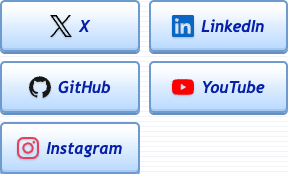

# Final production social-grid verification — v0.0.3

The narrow-screen cosmetic issue observed in the historical [C3 browser report](site-production-browser-0.0.3.md) is resolved in production. All 16 targeted checks pass after the [C4 deployment run](https://github.com/anisayari/codex-messenger/actions/runs/35879714229) succeeded for commit `ea557a2904bad7c1612b55004fb6c89e99354b03`. Checked at 2026-09-23T15:14:19.635Z.

## Evidence

- Production HTML is byte identical to final source after the workflow release-link transformation: 59,286 bytes, SHA256 `0c44b86a10c9af25991c594d1e16582d2cd37d57760474acd5cef923ce0d4253`.
- Final source HTML: 59,274 bytes, SHA256 `ee8db7d91372f1cad2b2370e6f0730833bbc96f3fc3e0edb424cff7cc40da665`.
- Google Chrome 153.0.8010.50, Playwright 1.62.1, isolated French locale with a stale French local-storage preference.
- English remains the default without an explicit language query.
- All 12 combinations of widths 320, 360, 361, 379, 380 and 390 px with EN/FR pass. The grid has two columns through 379 px and three from 380 px. Each link remains at least 48 px high; its content fits inside the border interior, with no internal or document horizontal overflow.
- The mobile chooser opens, focuses its close control, shows three official v0.0.3 platform links and closes by touch.
- No JavaScript exception, console error or HTTP error was recorded.
- The 320 px and 380 px production crops were visually reviewed.

The [structured report](site-social-grid-production-0.0.3.json) contains the checks, measurements and screenshot hashes. C3’s 37 full browser checks remain historical and unchanged; this targeted report completes their CSS follow-up. Testing covered Chrome emulation, not physical devices or other browser engines. No app or installer execution was repeated here.

## Screenshots

